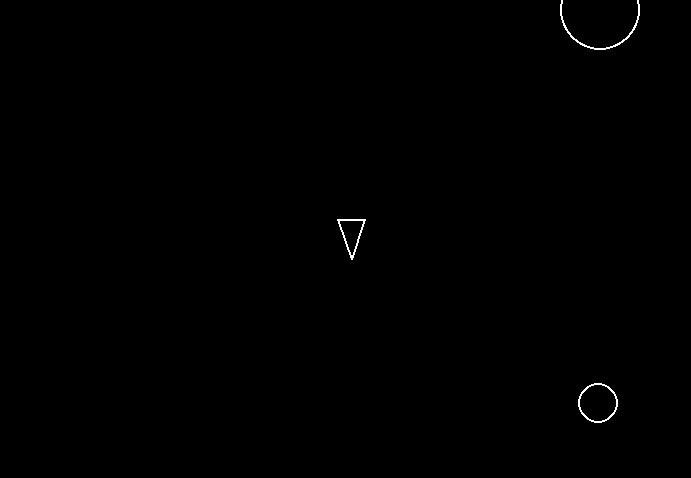

# Asteroids 
A classic Asteroids arcade game clone built with Python and pygame. Pilot your ship, dodge asteroids, and blast them apart to survive as long as you can!



## Features

- Player-controlled ship with rotation, thrust, and shooting mechanics.
- Randomly spawning asteroids that split into smaller pieces when destroyed.
- Collision detection between player, asteroids, and shots.
- Simple, vector-style graphics reminiscent of the original arcade game.
- Modular codebase for easy extension.

## Why Did I Build This

This project was created to practice Python game development using pygame, and to demonstrate core concepts like object-oriented programming, collision detection, and sprite management in a real-time game loop.

## Tech Stack

- [Python 3.10+](https://www.python.org/) for the core language.
- [Pygame](https://www.pygame.org/) for graphics, input, and game loop management.

## Usage

1. **Requires [uv](https://github.com/astral-sh/uv) package manager.**

2. **Create a virtual environment in the top-level directory:**
   ```sh
   uv venv
   ```
3. **Activate the virtual environment:**
   ```sh
   source .venv/bin/activate
   ```
4. **Install dependencies:**
   ```sh
   uv sync
   ```   

5. **Run the game:**
   ```sh
   uv run -m pygame
   ```   

## Controls
- `W` — Thrust forward
- `S` — Thrust backward
- `A` — Rotate left
- `D` — Rotate right
- `Space` — Shoot

## Lessons Learned

Building this game provided hands-on experience with real-time game loops, sprite groups, collision detection, and basic physics in 2D space. It also reinforced modular design and code readability in Python.

## Author

Thanks for checking out this project! Feel free to reach out with questions or suggestions.

- Portfolio: [nickabate.dev](https://nickabate.dev/)
- LinkedIn: [Nick Abate](https://www.linkedin.com/in/nick-abate/)